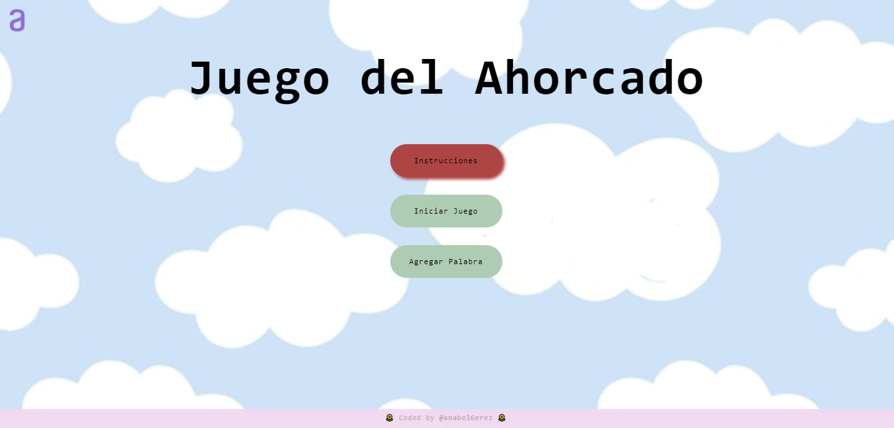

# 🍓 - Juego del Ahorcado

Juego del ahorcado que consiste en probar con diferentes letras hasta encontrar la palabra escondida, desarrollado como parte del Sprint 02 del Challenge Oracle ONE "Principiante en Programación".

# 💻 - Desarrollado con

# 📷 - Muestra

# 📌 - Requisitos
- 📎 Para comenzar el juego la página debe tener un botón de "Iniciar Juego".
- 📎 Debe funcionar solo con letras mayúsculas.
- 📎 No deben ser utilizadas letras con acentos ni caracteres especiales.
- 📎 No debe ser posible escribir números dentro del juego.
- 📎 La página debe tener guiones por cada letra de la palabra escondida, separados por un espacio.
- 📎 Las letras equivocadas deben aparecer en la pantalla, pero no pueden aparecer de forma repetida.
- 📎 Las letras correctas deben aparecer en la pantalla encima de los guiones, en la posición correcta con relación a la palabra.
- 📎 Al completar el dibujo de la horca, debe ser mostrado un mensaje "Fin del juego" en la pantalla.
-📎  Si se completa la palabra correcta antes de que se acaben los intentos, debe ser mostrado un mensaje de "Ganaste, felicidades" en la pantalla.
- 📎 La página debe tener un botón "Agregar palabra" y un campo para la inserción de texto con la finalidad de adicionar nuevas palabras al juego.
- 📎 Las palabras agregadas deben ser de un máximo de 8 letras.

# 🌻 - Más información

  <a href="https://www.oracle.com/ar/education/oracle-next-education/">
  

Este desafío forma parte del programa ONE - One Next Education, iniciativa promovida por Oracle y Alura LATAM. Para obtener más información detallada de este desafío visite el siguiente [enlace](https://github.com/alura-challenges/challenge-one-juego-ahorcado).
